# Project Name
**Home Daz**
## Description
# Home Daz

**Home Daz** is a comprehensive home service provider application designed to facilitate seamless service bookings for homeowners. Currently live in Canada, this app connects users with experts for home maintenance tasks. It consists of three main components: the **User App**, the **Contractor App**, and the **Admin Panel**, ensuring efficient management of service requests and contractor profiles.

### Key Features:
- **User App**: Homeowners can easily book various services for home maintenance, such as plumbing, electrical work, cleaning, etc.
- **Contractor App**: Contractors can create and manage their profiles to get service requests from users, enabling them to expand their reach and grow their business.
- **Admin Panel**: The admin has full control, managing contractor approvals, service offerings, customer complaints, and order assignments to experts.

---

### **Platform & Target Audience**
- **Platform**: Android & iOS
- **Target Audience**: Homeowners in need of reliable, expert home services and contractors seeking to connect with potential customers.

---

### **Technologies & Tools**
- **Development Tool**: Android Studio
- **Framework**: Flutter-based project
- **Design Architecture**: **MVVM**, **MVC**
- **Database**: **Firebase**
- **Security**: **SHA512 encryption** for secure data storage
- **State Management**: **Getx**
- **APIs Integrated**:
    - **Google Maps** for location-based service bookings
    - **Stripe Payment** for secure payment processing

---

#### **For Developers:**
1. Clone the repository to your local machine:
   ```bash
   git clone https://github.com/yourusername/Home-Daz.git


## Screenshots
### Home Page
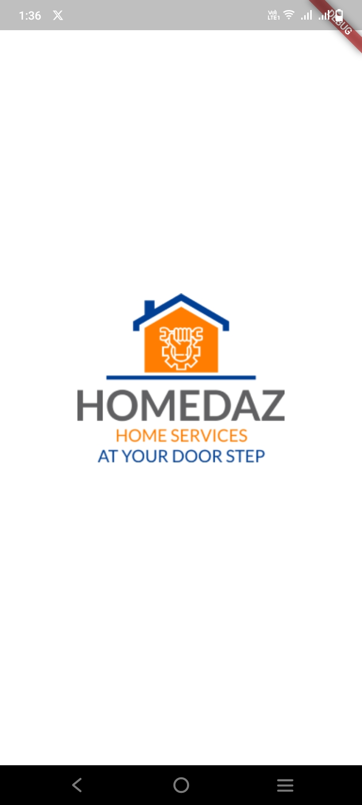
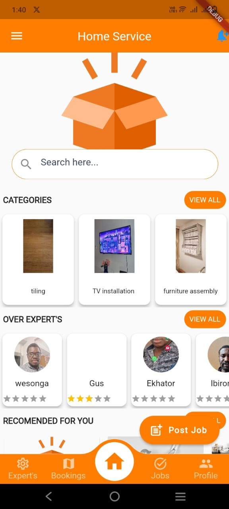
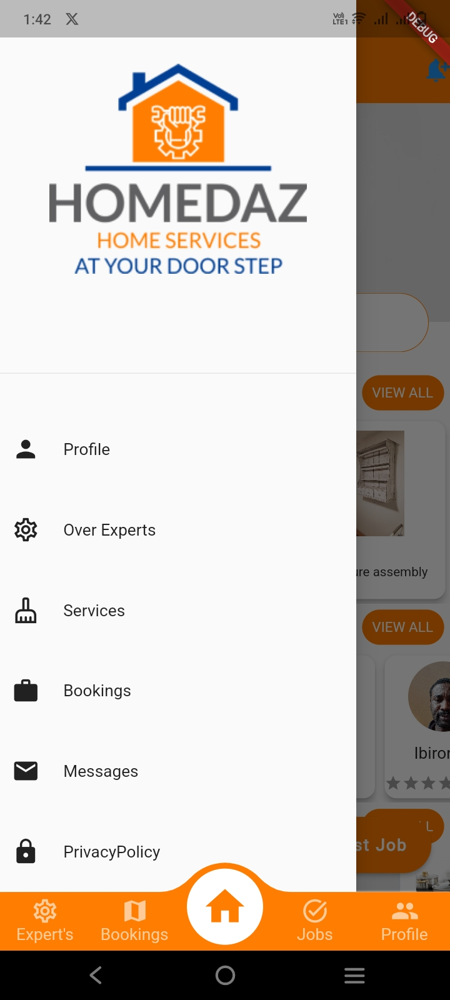
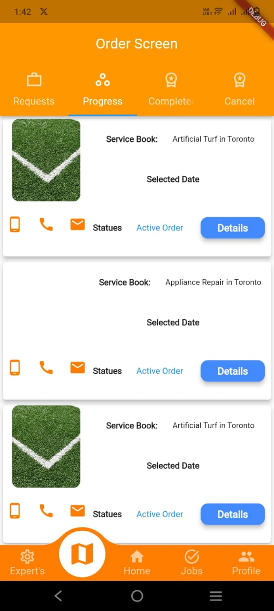

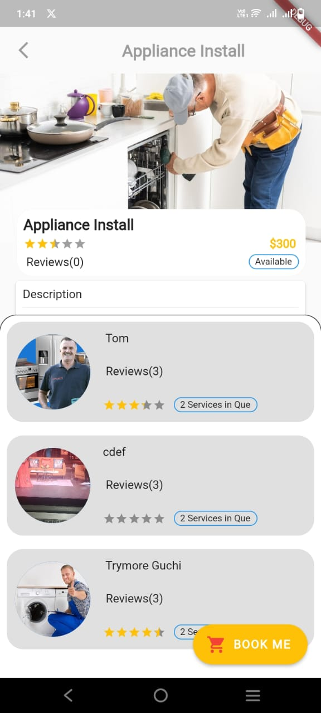
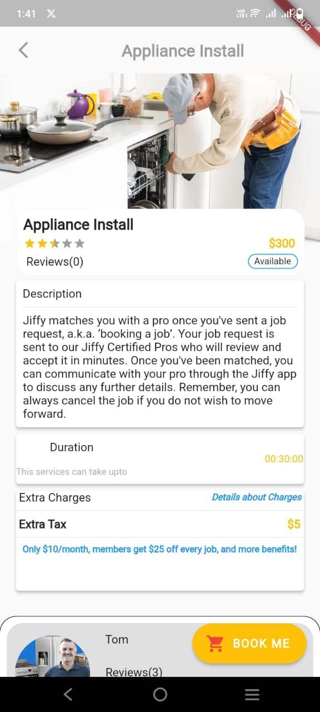
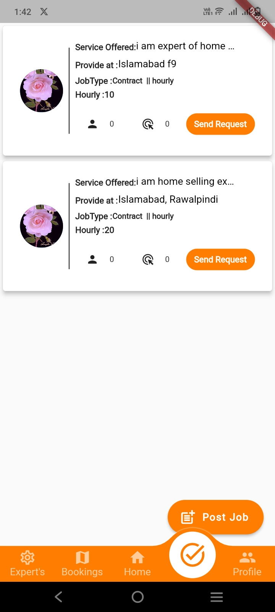
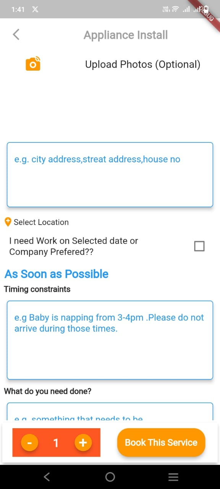
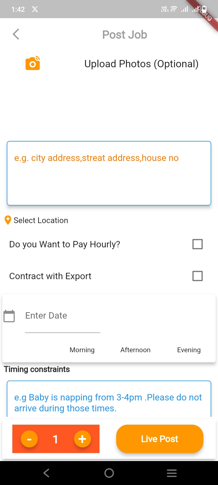
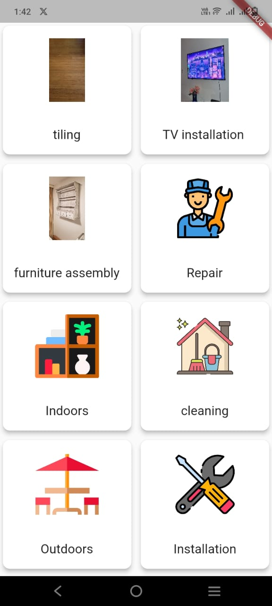
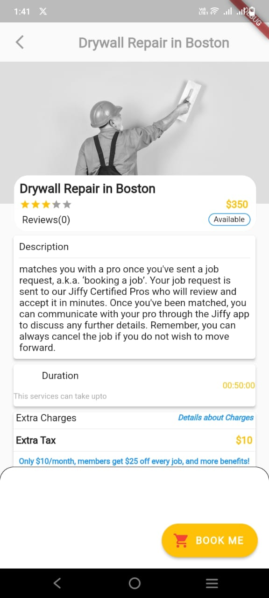
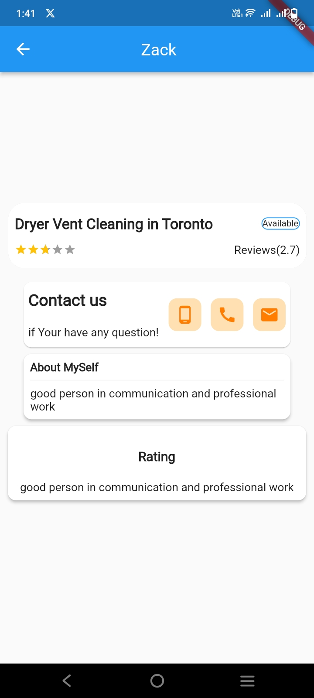
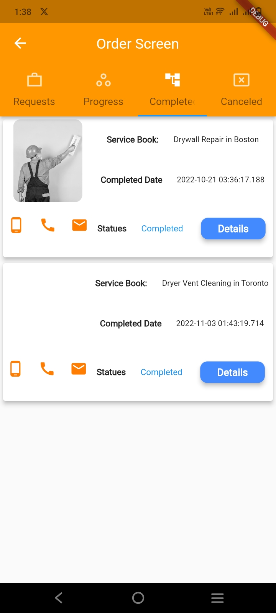
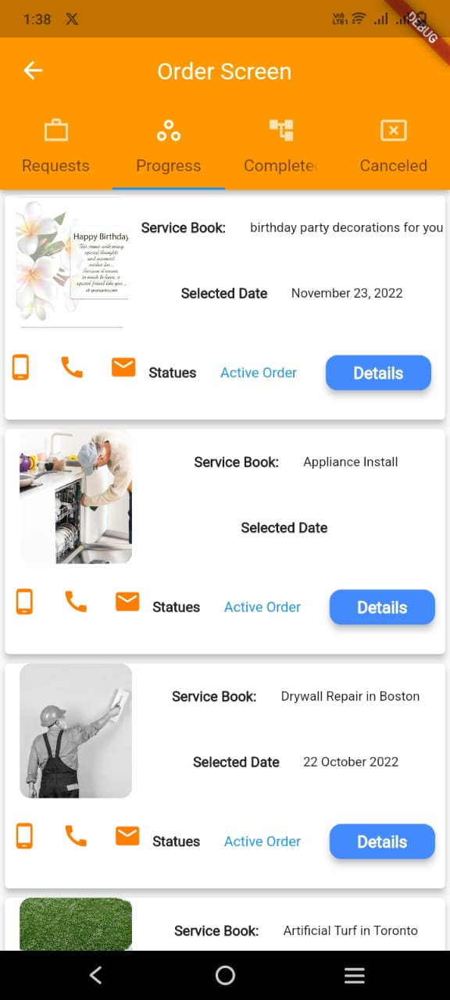


### Workflow Diagram

[//]: # (![Workflow Diagram]&#40;images/workflow-diagram.png&#41;)